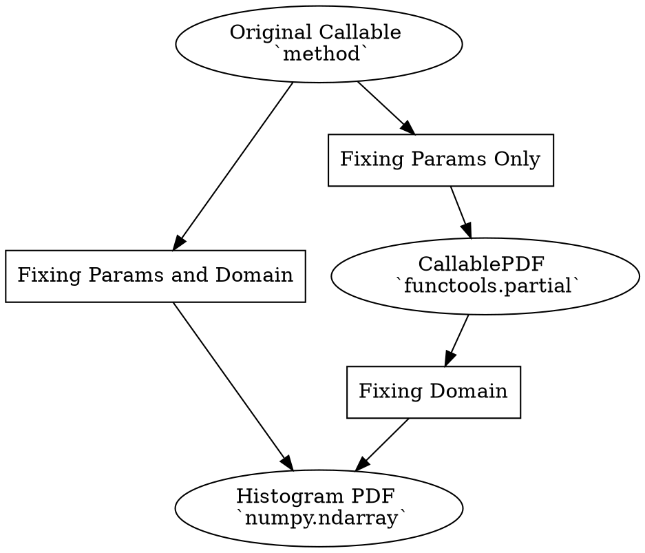

# Data Science Article - Probability Density Functions in Python 

## In Brief 

- There are 2 ways to reprsent Probability Density Functions (PDF)in Python: 
  - **Numpy Vector** (early evaluation) formally `numpy.ndarray`
  - **Callable Object** (lazy evaluation)




## Code 

### Imports 

```python=
import numpy as np
from scipy import stats
import matplotlib.pyplot as plt
```

### Domain 

```python=
x = np.arange(-10, 10, 0.01)
```
- this is representing the domain as `numpy.ndarray` 


### Numpy Vector 

```python=
# Example of Direct Definition 
y1 = stats.norm.pdf(x,0,2)
```
- Sampling the callable object on `x` specified domain of interest and producing another `numpy.ndarray`


### Callable Object 

The idea is to implement it fixing the arguments of the original callable object related to PDF Params so to leave just the domain as free argument, to be set in a lazy way 

To do this we need this additional import 

```python=
import functools
```

Now we can implement this returning a callable object 

```python=
# NOTE: The generic PDF is defined via the Arguments Partial Application 
f = functools.partial(stats.norm.pdf, loc=0, scale=2)
```
- this is a `functools.partial` 


We can then proceed with the final evaluation as follows 

```python=
y2 = f(x)
```
- it returns a `numpy.ndarray` 
 


